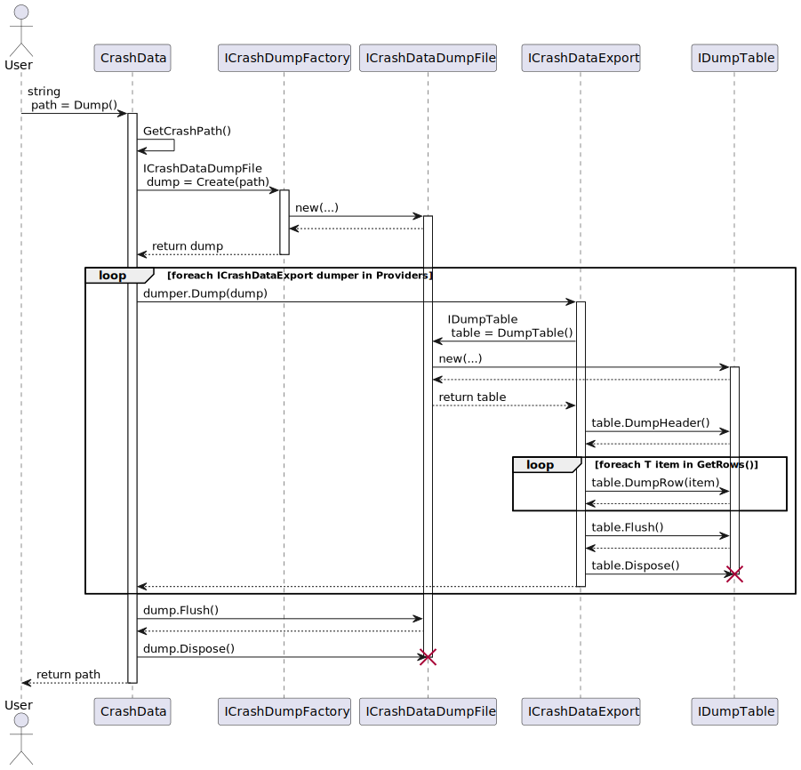
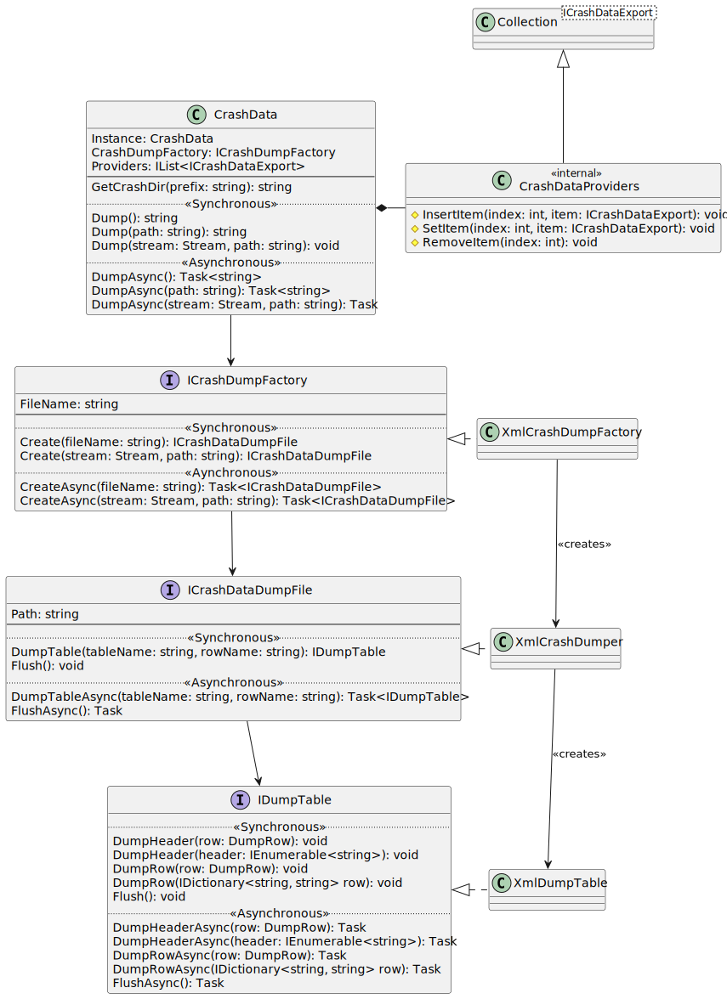
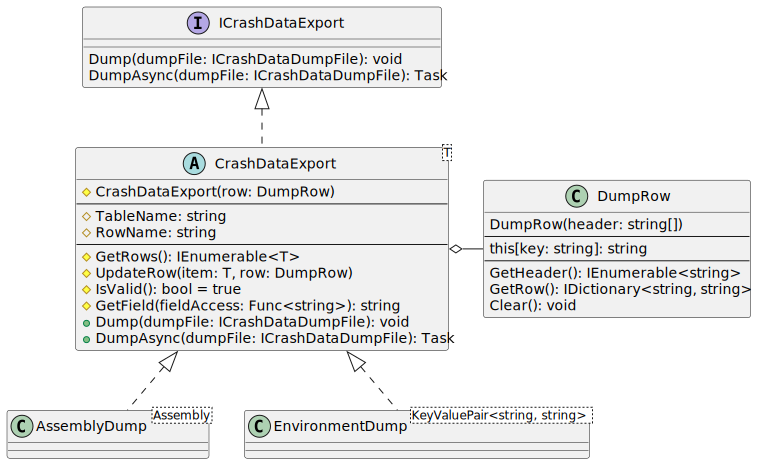

# Interal Crash Dump Implementation

This document covers the internal implementation details of the CrashReporter
dumping mechanism. This is useful for adding new dumpers.

## Top Level Providers

At the top level is the `RJCP.Diagnostics.Crash.CrashData.Instance.Providers`
property. This is initialised on the first access, and contains the following
dumpers:

- `NetVersionDump`: Dumps the current framework version.
- `AssemblyDump`: Dumps all known assemblies in the process.
- `EnvironmentDump`: Dumps all environment variables.
- `OSDump`: Dumps information about the OS.
- `ProcessDump`: Dumps process information.
- `ModuleDump`: Dumps all known moduels (libraries).
- `NetworkDump`: Dumps information about the network configuration.
- `ThreadDump`: Dumps native thread information.

On Windows:

- `WinVerDump`: Dumps informationa about the current running version of Windows.

## Performing a Dump

The sequence of how a dump is performed is shown as:

 

From the instance `CrashData.Instance`, the method `Dump()` creates a
`ICrashDataDumpFile` from `CrashDumpFactory.Create()`. The dump method in turn
iterates over all `Providers` of type `ICrashDataExport` dumping them.

The `ICrashDataDumpFile` knows how to create the file. The provided
implementation writes XML files, but alternative implementations can be provided
(e.g. on-disk JSON). The implementation assumes when dumping that data is
written to a file, but an alternative implementation could, if it desires, write
to a network interface, such as a REST API end-point (and still write a file to
disk).

Whlie the sequence diagram shows the synchronous path, there are equivalent
methods for .NET 4.5 asynchronous programming.

 

Each provider implements the `Dump()` method. The provider requests from the
given `ICrashDataDumpFile` an `IDumpTable` from `ICrashDataDumpFile.DumpTable`.
This object returns knows how to write the contents of the table to dump to the
file format specified (through the top level factory).

 

The `ICrashDataExport` has no knowledge of the output file format. It writes
using the provided `ICrashDataDumpFile`. The `ICrashDataDumpFile` object returns
an `IDumpTable` object that knows how to write to its file.