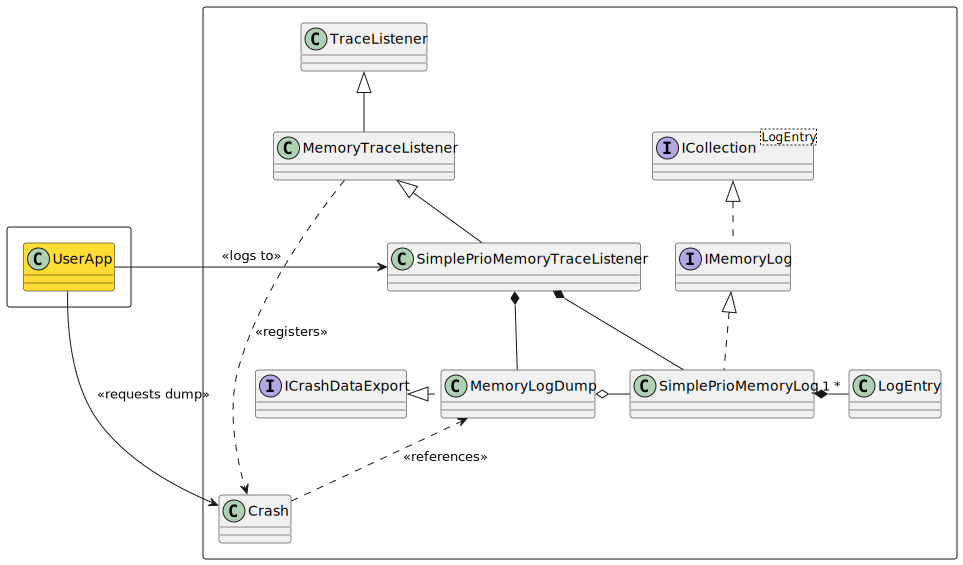

# Tracing using Crash Reporter

## Why use Crash Reporter

.NET Framework 4.x provides trace functionality, with the framework providing
`TraceListeners` that can log to the console or to a file. The .NET Core
provides an `ILogger` via a `ILoggerFactory` that has similar functionality.
They append logs as required. Most of the time these logs are not required, can
slow down your application slightly while writing to disk and more importantly,
fill up the space on the users harddisk, pushing the onus onto the user to
remove unneeded trace files, or to disable traces (and so have no possibility to
report issues without reenabling and spending significant effort to reproduce
the problem to report with traces).

This library provides a `TraceListener` for .NET 4.x and an `ILogger` for .NET
core, that allows traces to be logged to RAM initially. Traces are written to a
prioritized queue that discards old traces as RAM usage increases, and only
writes them to disk when instructed to do so (usually when there's a problem).

The `LogSource` class from the `RJCP.Diagnostics.Trace` library provides the
singleton required that `RJCP.Diagnostics.CrashReporter` can use to trace to a
trace listener (or your own `TraceListener` or `ILogger`).

## Quick Guide

### .NET Framework 4.x

On .NET Framework 4.x ,reference the `RJCP.Diagnostics.CrashReporter` library
into your project, and modify the `App.config` file to include the following:

```xml
  <system.diagnostics>
    <sharedListeners>
      <add name="myListener"
           type="RJCP.Diagnostics.Trace.SimplePrioMemoryTraceListener, RJCP.Diagnostics.CrashReporter"/>
      <add name="console" type="System.Diagnostics.ConsoleTraceListener"/>
    </sharedListeners>

    <sources>
      <source name="RJCP.CrashReporter" switchValue = "Warning">
        <listeners>
          <remove name="Default"/>
          <add name="myListener"/>
        </listeners>
      </source>
      <source name="RJCP.CrashReporter.Watchdog" switchValue = "Verbose">
        <listeners>
          <remove name="Default"/>
          <add name="myListener"/>
        </listeners>
      </source>
      <source name="CrashReporterApp" switchValue="Verbose">
        <listeners>
          <remove name="Default"/>
          <add name="myListener"/>
          <add name="console"/>
        </listeners>
      </source>
    </sources>
    <trace autoflush="true" useGlobalLock="false"/>
  </system.diagnostics>
```

Replace `CrashReporterApp` with the name of your applications `TraceSource`
name. The `RJCP.CrashReporter` and `RJCP.CrashReporter.Watchdog` should be
present, so that when there is a problem performing a crash dump, details will
be printed to the console.

This will capture all traces internally in RAM, and only output them to disk
when instructed to by your program.

```csharp
using System;
using System.IO;
using RJCP.Diagnostics;
using RJCP.Diagnostics.Dump;
using RJCP.Diagnostics.Trace;

namespace CrashReportApp
{
    static class Program
    {
        static void Main()
        {
            CrashReporter.SetExceptionHandlers();

            Log.App.TraceEvent(System.Diagnostics.TraceEventType.Information, "Program Started");

            // Dump all traces (no core dump) and information to the current directory
            string path = Path.Combine(Environment.CurrentDirectory, Crash.Data.CrashDumpFactory.FileName);
            Crash.Data.Dump(path);

            // Now simulate an unhandled exception, which creates a core dump
            throw new InvalidOperationException("An exception which should cause a dump");
        }
    }
}
```

#### Redefining the Queue Size

An application configuration can override the amount of messages that can be
logged in the `App.config` file.

```xml
    <sharedListeners>
      <add name="myListener"
           type="RJCP.Diagnostics.Trace.SimplePrioMemoryTraceListener, RJCP.Diagnostics.CrashReporter"
           Critical="100" Error="150" Warning="200" Information="250" Verbose="300"
           Other="100" Total="1500"/>
    </sharedListeners>
```

The attributes defined in the configuration file define the size of the queues.
If the Total is less than the sum of all the other queues, it will be implicitly
be set to the minimum required to accommodate all the queues. If it is larger,
then messages will be discarded later.

#### Logging Multiple Trace Sources into a Single Listener (.NET Framework 4.x)

Use the `<sharedListeners>` for each `<source>` in the `App.config`. Logging
will be placed into a single block.

### .NET Core (.NET Standard 2.1)

The .NET Core framework doesn't read the `app.config` file. While `TraceSource`
is part of the sources and is available, there is no singleton initializing the
tracing framework, and the client application writer must do this themselves.

This library provides the namespace `RJCP.Diagnostics.Logging` with extensions
to add a provider to the .NET host. Create an `ILoggerFactory` object and assign
it to the `LogSource` class provided by `RJCP.DLL.Trace` package as such:

```csharp
using Microsoft.Extensions.Configuration;
using Microsoft.Extensions.Logging;
using RJCP.Diagnostics.Trace;
using RJCP.Diagnostics.Logging;

public static class Log
{
    public static LogSource App { get; private set; }

    static Log()
    {
        IConfigurationRoot config = new ConfigurationBuilder()
            .AddJsonFile("appsettings.json", true, false)
            .Build();

        ILoggerFactory factory = LoggerFactory.Create(builder => {
            builder
                .AddConfiguration(config.GetSection("Logging"))
                .AddConsole()
                .AddSimplePrioMemoryLogger();
        });

        LogSource.SetLoggerFactory(factory);
        App = new LogSource("CrashReporterApp");
    }
```

Using the extension `.AddSimplePrioMemoryLogger()` creates the
`SimplePrioMemoryLogProvider` which instantiates the memory logger and registers
it with the Crash Dumper (`Crash.Data.Providers`) so that on case of a crash,
logs are attached.

See the example application `CrashReportApp exception` which generates a
`CrashDump.xml` file in the current directory with logs.

The example above shows how easy it is to add multiple `ILoggerProviders` with
the inbuilt `LoggerFactory` implementation by .NET. The extension methods
`.AddConsole()` can be chained with other loggers. This allows to log important
crash information also to the console to inform the user of a problem.

#### Using the LogSource

The `LogSource` API exposes the `TraceEventType`, which is mapped to the .NET
`LogLevel` enumeration.

#### Application Configuration File

The example in the previous section tells the .NET Core Framework to load the
application configuration file `appsettings.json`. You need to have the
appropriate package installed, namely `Microsoft.Extensions.Configuration.Json`.
See the example program `CrashReportApp` for a working example. The following
configuration file can be used:

```json
{
  "Logging": {
    "LogLevel": {
      "Default": "Warning",
    },
    "Console": {
      "IncludeScopes": true,
      "LogLevel": {
        "RJCP.CrashReporter": "Warning"
      }
    },
    "SimplePrioMemoryLogger": {
      "LogLevel": {
        "Default": "Trace"
      },
      "Critical": 200,
      "Error": 200,
      "Warning": 300,
      "Info": 400,
      "Verbose": 500,
      "Other": 200,
      "Total": 2000
    }
  }
}
```

This allows the configuration of the memory logger to be set by the application
configuration, without having to hard code it into the program. All logging is
done to memory, and only warnings from the crash reporter are printed to the
console.

#### Mapping of LogLevel to Crash Reporter TraceEventType

There isn't a one-to-one mapping between the `TraceEventType` and the
`LogLevel`. This results in some loss of information as logging from `LogSource`
(which uses the `TraceEventType` is mapped to the `ILogger` (which uses the
`LogLevel`), which is mapped back again to the memory log. This is because a
user is no longer restricted to using the `LogSource` if they instantiate and
use the `ILogger` direct.

| LogLevel             | mapped to TraceEventType   |
| -------------------- | -------------------------- |
| LogLevel.None        | TraceEventType.Critical    |
| LogLevel.Critical    | TraceEventType.Critical    |
| LogLevel.Error       | TraceEventType.Error       |
| LogLevel.Warning     | TraceEventType.Warning     |
| LogLevel.Information | TraceEventType.Information |
| LogLevel.Debug       | TraceEventType.Verbose     |
| LogLevel.Trace       | TraceEventType.Verbose     |

For reference, the `LogSource.TraceEvent` uses this mapping, and then the actual
log level in the memory dump when using this library.

| TraceEventType             | mapped to LogLevel   | Memory Log TraceEventType  |
| -------------------------- | -------------------- | -------------------------- |
| TraceEventType.Critical    | LogLevel.Critical    | TraceEventType.Critical    |
| TraceEventType.Error       | LogLevel.Error       | TraceEventType.Error       |
| TraceEventType.Warning     | LogLevel.Warning     | TraceEventType.Warning     |
| TraceEventType.Information | LogLevel.Information | TraceEventType.Information |
| TraceEventType.Verbose     | LogLevel.Debug       | TraceEventType.Verbose     |
| TraceEventType.Start       | LogLevel.Trace       | TraceEventType.Verbose     |
| TraceEventType.Stop        | LogLevel.Trace       | TraceEventType.Verbose     |
| TraceEventType.Suspend     | LogLevel.Trace       | TraceEventType.Verbose     |
| TraceEventType.Resume      | LogLevel.Trace       | TraceEventType.Verbose     |
| TraceEventType.Transfer    | LogLevel.Trace       | TraceEventType.Verbose     |

#### Other Differences to .NET 4.x

Other minor details when logging using the `ILogger` in the crash dump are:

- No thread information. The `TraceSource` provides this, but not the `ILogger`
  interface.
- The timestamp of the event is at the time of the logging by the library. The
  `TraceSource` provides this, but not the `ILogger` interface.

## Detailed Information

### The Trace Prioritized Queue

The implementation uses a prioritized queue with a priority based on the log
severity (in order given, the first being the highest priority):

| Trace Level                  | Default Queue Size (msgs) |
| ---------------------------- | ------------------------- |
| `TraceEventType.Critical`    | 200                       |
| `TraceEventType.Error`       | 200                       |
| `TraceEventType.Warning`     | 300                       |
| `TraceEventType.Information` | 400                       |
| `TraceEventType.Verbose`     | 500                       |
| Others                       | 200                       |
| Total                        | 2000                      |

Only when the maximum (Total) number of messages have been logged will messages
be discarded. Messages of the lowest priority will be discarded first, up to the
priority of the new message being logged.

The assumption is that at the time of the crash information which is nearest to
the time of the crash are most important. But sometimes old information such as
warnings or errors may be relevant (such as startup) which have an effect later
on in the program. Thus, it is guaranteed there will be a minimum number of
those types of messages being logged requiring the prioritized queue.

### Performing a Dump Programmatically

To execute a dump to access the trace information (among other information), add
the following in your code:

```csharp
string fileName = CrashReporter.CreateDump(RJCP.Diagnostics.Dump.CoreType.None);
Console.WriteLine("DumpFile: {0}", fileName);
```

The output is generally placed into `%LOCALAPPDATA%\CrashDumps` and is a ZIP
file with the relevant information, named after the date/time and a GUID (to
avoid collisions).

Default behaviour is to create a XML file with the content.

### Performing a Dump on Unhandled Exceptions

Recommended guidelines is to only capture exceptions which are known. Unhandled
exceptions are then caught by the application domain. To create a dump when an
exception is unhandled:

```csharp
static void Main() {
    CrashReporter.Source = new TraceSource("CrashReporterApp");
    CrashReporter.SetExceptionHandlers();

    DoWork();
}
```

The `SetExceptionHandlers` will register the `AppDomain.UnhandledException` and
the `AppDomain.FirstChanceException`. On Mono, the `FirstChanceException` is not
defined, so this library uses reflection to register the handlers, so your code
will continue to compile also on Mono.

#### XML Crash Dump Logging

All errors when writing the XML crash dump file are logged to `RJCP.CrashReporter`.

#### Crash Reporter

- First Chance Exceptions are logged to the `CrashReporter.Source` property. The
  default source is `RJCP.CrashReporter`.
- Unhandled Exceptions are logged to the `CrashReporter.Source` property. The
  default source is `RJCP.CrashReporter`.
- The actual creation of crash dumps (either success or failure) are logged to
  `RJCP.CrashReporter`
  - `Information`: Crash is created and its location
  - `Warning`: If the crash dump directory couldn't be properly cleaned. This
    indicates a problem with the user account, which shouldn't occur.
  - `Error`: Crash dump file couldn't be created (or the ZIP file can't be
    generated).

#### Watchdog Logging

See the [developer watchdog](dev-watchdog.md) document for specific details.

## Detailed Design

### Logging Design

#### TraceListener

The implementation for .NET 4.x trace listener relies on the .NET Framework
having a singleton instance and the functionality to read an applications
configuration file (in XML).

 

The user application can simplify the usage further by using `LogSource`, and
has similar API to the `TraceSource` from .NET.

When the `SimplePrioMemoryTraceListener` is disposed (which only makes sense
when the application instantiates the trace listener direct, otherwise the .NET
framework has a singleton instance and it never needs to be disposed) is the
crash dump handler `MemoryDump` unregistered and cleared. That also stops any
logs being printed if it is disposed before a dump occurs.

#### ILoggerProvider

For .NET Core, the `ILogger` implementation provided by this library is a
wrapper around the `MemoryDump` internal class.

 

Common components with the Trace Listener are the `MemoryLogDump` which both
loggers use to write the incoming logs. The `SimplePrioMemoryProvider` registers
with the crash handler to dump the contents of the `MemoryLogDump`.

The `SimplePrioMemoryProvider` will unregister from the crash handler when it is
disposed of.
